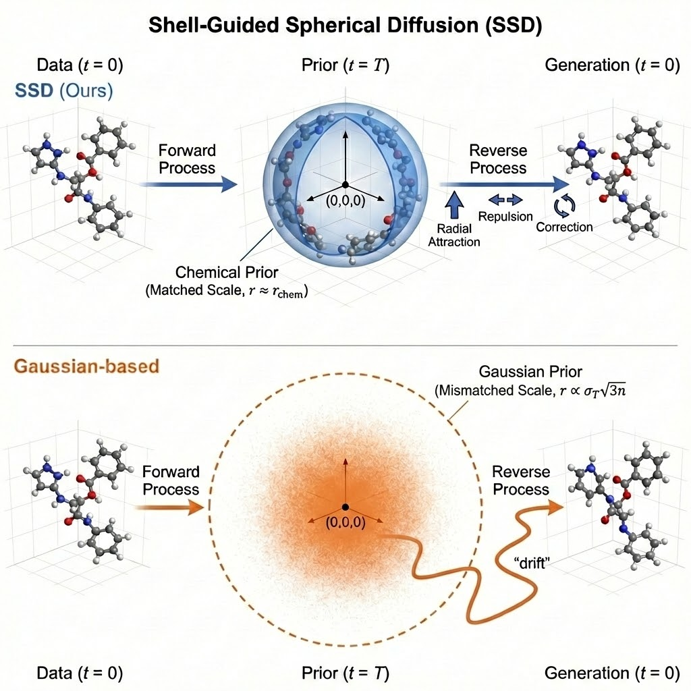
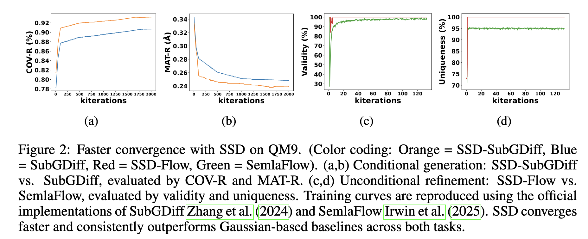
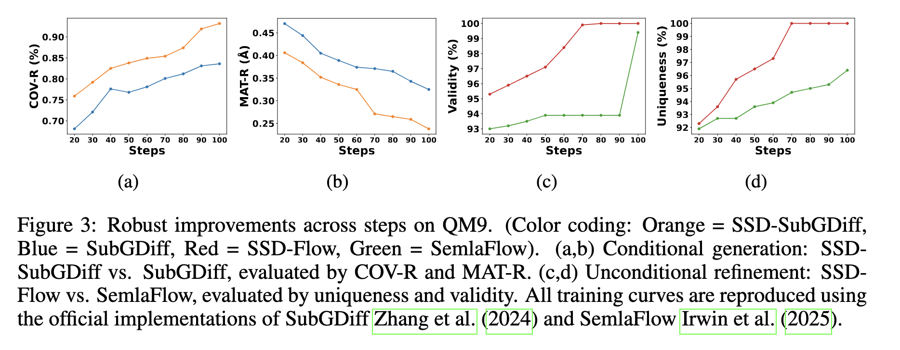
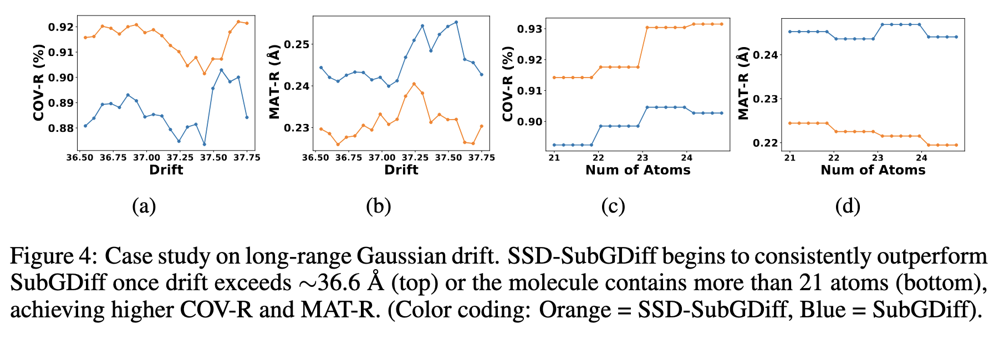
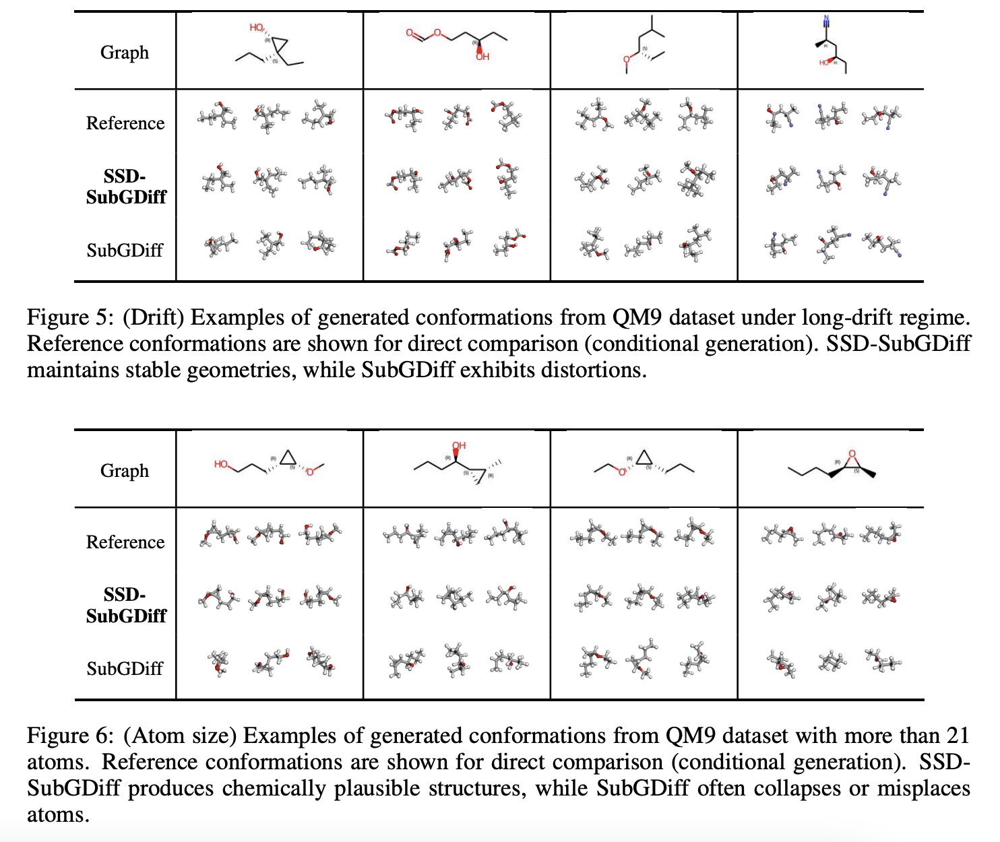

# Anonymous Implementation of SSD

This repository provides the anonymous implementation of our method (SSD).  
It includes training, inference, and evaluation scripts to reproduce the main results.  
All author-identifying information has been removed in accordance with the double-blind policy.

SSD is a geometry-aware generative framework for 3D molecular conformations, replacing Gaussian priors with dataset-adaptive spherical shells and structured dynamics.

---

## Overview

<p align="center">
  
</p>

**Key contributions of SSD:**
- Spherical-shell initialization instead of Gaussian noise  
- Structured dynamics (radial contraction, repulsion, equivariant correction)  
- Seamless integration with diffusion and flow-matching backbones  

---

## Quick Start (Reproduce Results)
We provide inference scripts to directly reproduce the results across different evaluation protocols as reported in the paper:

- **Table 3 (Conditional Generation):**
  - **SubGDiff Protocol**: Benchmarking against GeoDiff and SubGDiff.
  - **MCF Protocol**: Benchmarking against the original MCF implementation.
- **Table 3 (Unconditional Refinement):**
  - **SemlaFlow Protocol**: Benchmarking against EDM and SemlaFlow.

```bash
# Create environment
conda env create -f env.yml

# Activate environment
conda activate ssd
````

---

## Resources
The dataset and checkpoints are available [here](https://zenodo.org/records/17149438).

---


## Training

All hyperparameters and training settings are specified in
`./configs/*.yml`.
Feel free to adjust these parameters as needed.

**Example training commands:**

```bash
# Conditional
python train.py ./configs/qm9_condition.yml
python train.py ./configs/drugs_condition.yml

# Unconditional
python train.py ./configs/qm9_uncondition.yml
python train.py ./configs/drugs_uncondition.yml
```

---

## Inference / Generation

**Conditional generation on QM9:**
1. SubGDiff Protocol
Used for benchmarking against GeoDiff and SubGDiff.

```bash
python test_condition.py \
  --ckpt checkpoints/qm9_condition.pt \
  --config configs/qm9_condition.yml \
  --test_set data/GEOM/QM9/test_data_1k.pkl \
  --start_idx 800 --end_idx 1000 \
  --sampling_type same_mask_noisy \
  --n_steps 100 \
  --device cuda:1 \
  --w_global 0.1 \
  --clip 1000 \
  --clip_local 20 \
  --global_start_sigma 5
```

2. MCF Protocol
```bash
python test_mcf.py --task_config configs/test_qm9.yaml
```

**Unconditional generation on QM9:**

```bash
python test_uncondition.py \
  --ckpt checkpoints/qm9_uncondition.pt \
  --n_step 100
```

---

## Evaluation

After generating conformations, all benchmark tasks can be evaluated directly from the output data.

**COV and MAT metrics on GEOM datasets for conditional molecular generation:**

```bash
python eval_covmat.py checkpoints/qm9_condition/samples/sample_all.pkl
```

**metrics on GEOM datasets for unconditional molecular generation:**
```bash
python eval_analyze.py --model_path outputs/qm9
```


We also release training logs and evaluation dumps for all experiments,
allowing you to benchmark your own methods against SSD under identical splits.

---

## Figures & Data

### Figure 2: Faster convergence with SSD on QM9

<p align="center">
  
</p>

* The file is available [**here**](./assets/metrics_ssd.csv)

---

### Figure 3: Robust improvements across steps on QM9

<p align="center">
  
</p>

* The file is available [**here**](./assets/samplingsteps_ssd&subgdiff.csv) and [**here**](./assets/samplingsteps_ssd&semlaflow.csv)

---

### Figure 4: Case study on long-range Gaussian drift

<p align="center">
  
</p>

* The file is available [**here**](./assets/Case_study.ipynb)

---

### Figure 5 & 6: Extended results

You can regenerate Figure 5 & 6 directly using our evaluation toolkit.

<p align="center">
  
</p>

Run the following notebook:

```bash
jupyter notebook visualization.ipynb
```


